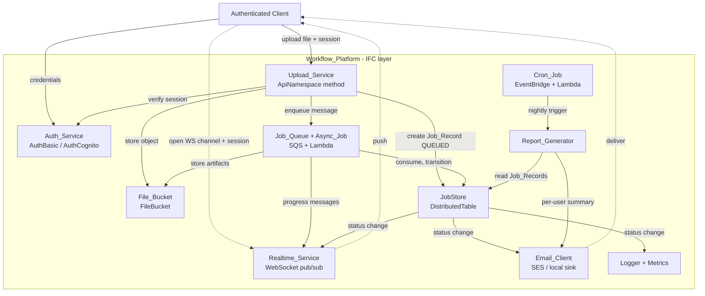
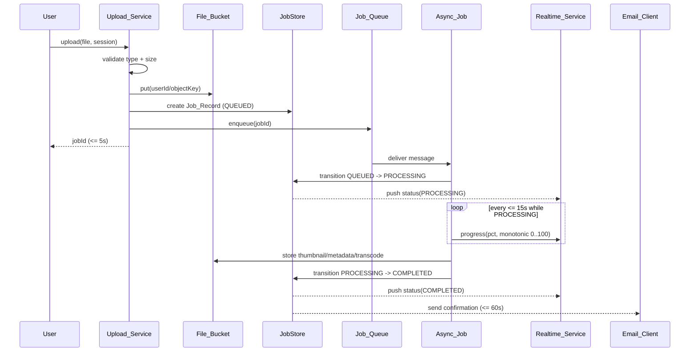

# Design Document

## Overview

The event-driven-workflows feature is a standalone media upload-and-processing application built on [AWS Blocks](https://docs.aws.amazon.com/blocks/latest/devguide/what-is-blocks.html). It composes the core Blocks — `AuthBasic`/`AuthCognito`, `FileBucket`, `AsyncJob`, `Realtime`, `EmailClient`, `CronJob`, plus `Logger` and `Metrics` — into an event-driven workflow: an authenticated user uploads a file, the file is validated and stored, a background job processes it (thumbnails, metadata, transcoding), live progress is streamed to the client over a WebSocket channel, a completion/failure email is sent, and a nightly scheduled job emails each user a usage summary.

AWS Blocks is a TypeScript "Infrastructure from Code" (IFC) toolkit. Each Block is a self-contained package that bundles a typed runtime API, automatic AWS resource provisioning, and a local implementation. Node.js [conditional exports](https://docs.aws.amazon.com/blocks/latest/devguide/concepts.html) route the same `import` to a local implementation during development (`npm run dev`, in-memory/filesystem under `.bb-data/`), to CDK constructs during synthesis, and to AWS SDK calls at Lambda runtime. This is the mechanism that satisfies every `Local_Development_Mode` versus `Production_Mode` requirement without branching application code: the platform writes business logic once against the Block APIs, and the runtime selects the correct backing implementation. *(Content was rephrased for compliance with licensing restrictions.)*

Key design decisions:

- **The application code is mode-agnostic.** Requirements that distinguish local from production behavior (1.4/1.5, 3.8/3.9, 5.5/5.6, 6.6/6.7) are satisfied by choosing the correct Block variant at composition time (the IFC layer) rather than by conditional logic in handlers. Only the auth Block is selected explicitly by mode; the rest resolve automatically through conditional exports.
- **Job_Record is the single source of truth** for a job's lifecycle. All observable behaviors — status transitions, real-time messages, emails, metrics, and reports — are derived from Job_Record state changes routed through one choke point (`JobStore.transition`) so that logging, notification, and metrics happen consistently for every transition.
- **The Job_Status lifecycle is modeled as an explicit state machine** with terminal states (`COMPLETED`, `FAILED`) that reject further transitions. This makes idempotency (3.7) and at-least-once queue delivery safe.
- **Pure domain logic is separated from I/O.** Validation, the status state machine, progress computation, and report aggregation/serialization are pure functions. This is what makes the correctness properties in this document testable with property-based testing while the Blocks I/O layer is exercised with example and integration tests.

### Requirements Coverage Summary

| Requirement | Primary components |
|---|---|
| 1. User Authentication | Auth_Service (`AuthBasic`/`AuthCognito`), session + lockout logic |
| 2. File Upload and Validation | Upload_Service (`ApiNamespace`), `FileBucket`, `JobStore` |
| 3. Async Processing Lifecycle | Async_Job (`AsyncJob`), Job state machine, `FileBucket` |
| 4. Real-Time Progress | Realtime_Service (`Realtime`), progress publisher |
| 5. Completion/Failure Email | Email_Client (`EmailClient`), retry policy |
| 6. Nightly Scheduled Report | Cron_Job (`CronJob`), Report_Generator, serialization |
| 7. Observability & Audit Logging | `Logger`, `Metrics` |

## Architecture

### System Composition

The platform is defined in a single IFC entry point (`aws-blocks/index.ts`) where all Blocks are instantiated in one `Scope` and the upload API is exposed through an `ApiNamespace`. Persistent job state lives in a `DistributedTable` Block (structured records with secondary indexes for query-by-user and query-by-completion-time, both required by reporting). Configuration constants (session lifetime, accepted types, max size, retry counts, schedule) are held in `AppSetting` Blocks so they are tunable without code changes.



### Event Flow: Upload → Completion



### Local vs Production Resolution

| Concern | Local_Development_Mode | Production_Mode |
|---|---|---|
| Auth (Req 1.4/1.5) | `AuthBasic` (username/password + JWT) | `AuthCognito` |
| Async processing (Req 3.8/3.9) | In-process handler, local queue emulation | SQS queue + Lambda consumer |
| Real-time (Req 4) | In-process EventEmitter + local WebSocket server | API Gateway WebSocket + DynamoDB connections |
| Email (Req 5.5/5.6) | Local capture sink (`.bb-data/`) | Amazon SES |
| Cron (Req 6.6/6.7) | Node timer + on-demand local invocation command | EventBridge rule + Lambda |
| Job storage | Filesystem-backed `DistributedTable` | DynamoDB |

The application never inspects the mode. The auth variant is the only component selected explicitly (a single instantiation switch in the IFC layer keyed off an environment flag); all other Blocks resolve through conditional exports.

## Components and Interfaces

### Auth_Service

Wraps the auth Block and adds the platform-specific session-lifetime and lockout policy. `getCurrentUser` reads the session credential from `BlocksContext` and returns the owning `userId`, associating every request with its user (Req 1.6).

```typescript
interface AuthService {
  // Req 1.1, 1.2, 1.7: issue session on valid creds; reject invalid without field disclosure; lockout
  login(username: string, password: string): Promise<LoginResult>;
  // Req 1.3, 1.6: resolve the authenticated user for a request; throws AuthorizationError if missing/expired/invalid
  getCurrentUser(context: BlocksContext): Promise<AuthenticatedUser>;
}

type LoginResult =
  | { ok: true; sessionToken: string; expiresAt: number }        // expiresAt = now + 30 min
  | { ok: false; error: "INVALID_CREDENTIALS" }                  // no field-level detail (Req 1.2)
  | { ok: false; error: "ACCOUNT_LOCKED"; retryAfter: number };  // 15 min lockout after 5 fails (Req 1.7)

interface AuthenticatedUser { userId: string; email: string; }
```

The lockout tracker is a pure state machine over an attempt counter keyed by username: 5 consecutive failures within the tracking window transition the account to `LOCKED` for 15 minutes; a successful login resets the counter. This logic is unit/property-tested independently of the auth Block.

### Upload_Service

An `ApiNamespace` method. It orchestrates validation, storage, record creation, and enqueue with strict ordering so that partial-failure requirements (2.6, 2.7) hold.

```typescript
interface UploadService {
  // Req 2.1–2.7
  upload(context: BlocksContext, file: UploadInput): Promise<UploadResult>;
}

interface UploadInput { filename: string; contentType: string; sizeBytes: number; body: ReadableStream; }

type UploadResult =
  | { ok: true; jobId: string }                                   // Req 2.5: returned within 5s
  | { ok: false; error: "UNSUPPORTED_TYPE"; unsupportedType: string }        // Req 2.2
  | { ok: false; error: "INVALID_SIZE"; acceptedRange: { min: 1; max: 104857600 } } // Req 2.3
  | { ok: false; error: "STORAGE_FAILED" }                        // Req 2.6
  | { ok: false; error: "ENQUEUE_FAILED"; jobId: string };        // Req 2.7: record set to FAILED
```

Orchestration order (each step gated on the previous):
1. `getCurrentUser` (rejects unauthenticated uploads — Req 1.3).
2. `validateUpload` (pure) — reject unsupported type / invalid size *before* any storage (Req 2.2, 2.3).
3. `FileBucket.put(userId/objectKey)` — on failure, return `STORAGE_FAILED`, create no record, enqueue nothing (Req 2.6).
4. `JobStore.create(QUEUED)` — exactly one Job_Record (Req 2.4).
5. `Job_Queue.enqueue(jobId)` — on failure, `JobStore.transition(jobId, FAILED)` and return `ENQUEUE_FAILED` (Req 2.7).

### File_Bucket

Thin wrapper over `FileBucket`. Objects are namespaced by owner (`{userId}/{jobId}/...`) so ownership is encoded in the key path (supports Req 2.1 and per-user isolation). Stores original uploads and generated artifacts (thumbnail, metadata JSON, transcoded output).

```typescript
interface FileStore {
  put(key: string, body: ReadableStream, contentType: string): Promise<void>;
  putArtifact(jobId: string, artifact: Artifact): Promise<string>; // returns stored key
}
```

### JobStore and the Job Status State Machine

`JobStore` is the single choke point for all state changes. Every transition runs through `transition`, which (a) validates the transition against the state machine, (b) persists timestamps, (c) emits the audit log (Req 7.1), (d) records metrics on terminal transitions (Req 7.2, 7.3), and (e) triggers downstream notification (Realtime push + Email). Terminal states reject further transitions, which is what enforces idempotency for at-least-once queue delivery (Req 3.7).

```typescript
type JobStatus = "QUEUED" | "PROCESSING" | "COMPLETED" | "FAILED";

// Pure function: legal transitions only
function nextStatus(current: JobStatus, event: JobEvent): TransitionResult;
type JobEvent = "START" | "COMPLETE" | "FAIL";
type TransitionResult =
  | { kind: "transition"; to: JobStatus }
  | { kind: "noop" }        // event applied to terminal state -> discard (Req 3.7)
  | { kind: "illegal" };    // e.g. COMPLETE before START

interface JobStore {
  create(input: NewJobInput): Promise<JobRecord>;                 // Req 2.4 (QUEUED)
  get(jobId: string): Promise<JobRecord | null>;
  transition(jobId: string, event: JobEvent, patch?: JobPatch): Promise<JobRecord>;
  // Reporting queries (secondary indexes)
  findByUserAndCompletionWindow(userId: string, start: number, end: number): Promise<JobRecord[]>;
  listUsersWithActivity(start: number, end: number): Promise<string[]>;
}
```

Legal transition table:

| From \ Event | START | COMPLETE | FAIL |
|---|---|---|---|
| QUEUED | → PROCESSING | illegal | → FAILED |
| PROCESSING | illegal | → COMPLETED | → FAILED |
| COMPLETED | noop | noop | noop |
| FAILED | noop | noop | noop |

### Async_Job

The `AsyncJob` handler consumes a queue message referencing a `jobId` and drives processing. Locally it runs in-process; in production it is an SQS-triggered Lambda (Req 3.8, 3.9). Retries (up to 3 attempts) and dead-letter routing are configured on the Block (Req 3.4, 3.5).

```typescript
interface ProcessingHandler {
  // Req 3.1–3.7
  handle(message: JobMessage): Promise<void>;
}
```

Handler algorithm:
1. Load Job_Record. If already `COMPLETED`/`FAILED`, discard without change (Req 3.7).
2. `transition(START)` → `PROCESSING`, record start timestamp (Req 3.1, 3.6).
3. Start progress publisher (emits monotonic 0→100 at least every 15s while `PROCESSING`, Req 4.4).
4. Run thumbnail generation → metadata extraction → transcoding. On any step error, `transition(FAIL)` with a human-readable error description (Req 3.3) and let the message be retried; after 3 attempts the Block routes to the dead-letter destination (Req 3.4, 3.5).
5. On success, store artifacts (Req 3.2), `transition(COMPLETE)`, record completion timestamp (Req 3.6).

### Realtime_Service

Wraps the `Realtime` Block with a per-user channel namespace defined by Zod schemas. Connections are authenticated at open time (Req 4.2); each connection subscribes only to its owner's channel (Req 4.1, 4.7). Messages to a channel with no connected client are silently dropped by the Block (Req 4.5). Delivery is strictly owner-scoped (Req 4.7).

```typescript
interface RealtimeService {
  authorizeAndSubscribe(context: BlocksContext, connectionId: string): Promise<void>; // Req 4.1, 4.2
  pushStatus(userId: string, msg: StatusMessage): Promise<void>;   // Req 4.3
  pushProgress(userId: string, msg: ProgressMessage): Promise<void>; // Req 4.4
  onDisconnect(connectionId: string): Promise<void>;               // Req 4.6
}

interface StatusMessage { jobId: string; status: JobStatus; at: number; }
interface ProgressMessage { jobId: string; percentComplete: number; at: number; } // 0..100 inclusive
```

Progress percentages for a given job are computed by a pure, monotonically non-decreasing function of processing stage, so successive values never regress (Req 4.4).

### Email_Client

Wraps `EmailClient` (SES in production, local sink for dev — Req 5.5, 5.6) and applies a retry policy (1–10 attempts, default 3 — Req 5.3, 5.4). Send outcomes are logged (Req 7.4, 7.5).

```typescript
interface EmailService {
  sendConfirmation(job: JobRecord, user: AuthenticatedUser): Promise<SendOutcome>;   // Req 5.1
  sendFailureNotice(job: JobRecord, user: AuthenticatedUser): Promise<SendOutcome>;  // Req 5.2
  sendReport(summary: UserSummary, user: AuthenticatedUser): Promise<SendOutcome>;   // Req 6.3, 6.5
}

type EmailType = "CONFIRMATION" | "FAILURE_NOTIFICATION" | "REPORT_SUMMARY";
type SendOutcome = { ok: true } | { ok: false; permanentFailure: true }; // after retries exhausted (Req 5.4)
```

### Cron_Job and Report_Generator

The `CronJob` fires at the configured nightly time (EventBridge in prod; on-demand local command in dev — Req 6.6, 6.7). It invokes the `Report_Generator`, which aggregates per-user, per-status counts over the 24-hour window ending at the scheduled time (Req 6.1, 6.2), excludes users with no activity (Req 6.4), serializes each summary to a stored report record (Req 6.8), and hands each summary to the Email_Client (Req 6.3, 6.5).

```typescript
interface ReportGenerator {
  run(scheduledAt: number): Promise<ReportRun>; // window = [scheduledAt - 24h, scheduledAt]
}

// Pure aggregation over records within the window
function aggregate(records: JobRecord[], period: ReportingPeriod): UserSummary[];

interface UserSummary {
  userId: string;
  period: ReportingPeriod;              // { start, end }
  counts: Record<JobStatus, number>;    // QUEUED/PROCESSING/COMPLETED/FAILED
}

// Req 6.8: serialize(summary) then deserialize reproduces identical counts + period
function serializeSummary(s: UserSummary): string;
function deserializeSummary(raw: string): UserSummary;
```

### Logger and Metrics

`Logger` produces structured JSON entries; `Metrics` records counts and durations (CloudWatch EMF in production). A single `recordTransition` helper is invoked from `JobStore.transition` to guarantee every status change is logged (Req 7.1) and terminal transitions produce metrics (Req 7.2, 7.3). The Logger redacts file contents and credentials from all entries (Req 7.7).

```typescript
interface Observability {
  logStatusChange(e: StatusChangeLog): void;    // Req 7.1
  recordProcessingDuration(jobId: string, ms: number): void; // Req 7.2
  incrementFailedJobs(): void;                   // Req 7.3
  logEmailOutcome(e: EmailOutcomeLog): void;     // Req 7.4, 7.5
  logReportRun(e: ReportRunLog): void;           // Req 7.6
}
```

## Data Models

### JobRecord

```typescript
interface JobRecord {
  jobId: string;              // ULID
  userId: string;             // owner (Req 1.6, 2.1)
  objectKey: string;          // {userId}/{jobId}/original
  status: JobStatus;          // QUEUED | PROCESSING | COMPLETED | FAILED
  startedAt: number | null;   // Req 3.6, 7.2
  completedAt: number | null; // Req 3.6, 7.2 (COMPLETED or FAILED)
  attempts: number;           // Req 3.4 (0..3)
  artifacts: Artifact[];      // Req 3.2, 5.1
  errorDescription: string | null; // Req 3.3, 5.2 (human-readable; no file contents)
  createdAt: number;
  updatedAt: number;
}

interface Artifact { type: "THUMBNAIL" | "METADATA" | "TRANSCODE"; key: string; }
```

Secondary indexes on the `DistributedTable`: `byUser` (partition `userId`) and `byCompletion` (`userId` + `completedAt`) to support `findByUserAndCompletionWindow` and `listUsersWithActivity` (Req 6.2, 6.4).

### Session / Auth State

```typescript
interface Session { userId: string; issuedAt: number; expiresAt: number; } // 30-min lifetime (Req 1.1)

interface LockoutState {
  username: string;
  consecutiveFailures: number;   // resets on success
  lockedUntil: number | null;    // now + 15 min after 5th failure (Req 1.7)
}
```

### Messages and Reports

```typescript
interface JobMessage { jobId: string; enqueuedAt: number; }

interface ReportingPeriod { start: number; end: number; } // end = scheduledAt, start = end - 24h

// Stored report record (Req 6.8 round-trip)
interface StoredReport { userId: string; period: ReportingPeriod; counts: Record<JobStatus, number>; }
```

### Configuration (AppSetting)

| Setting | Default | Requirement |
|---|---|---|
| `sessionLifetimeMs` | 1,800,000 (30 min) | 1.1 |
| `maxLoginFailures` | 5 | 1.7 |
| `lockoutMs` | 900,000 (15 min) | 1.7 |
| `acceptedTypes` | configured set | 2.1, 2.2 |
| `maxUploadBytes` | 104,857,600 (100 MB) | 2.1, 2.3 |
| `maxProcessingAttempts` | 3 | 3.4 |
| `progressIntervalMs` | 15,000 | 4.4 |
| `emailMaxRetries` | 3 (range 1–10) | 5.3 |
| `nightlyScheduleCron` | daily | 6.1 |

## Correctness Properties

*A property is a characteristic or behavior that should hold true across all valid executions of a system — essentially, a formal statement about what the system should do. Properties serve as the bridge between human-readable specifications and machine-verifiable correctness guarantees.*

The properties below were derived from the acceptance-criteria prework. Redundant criteria were consolidated: the Job_Status transitions (3.1, 3.7) are unified into one state-machine property; successful-processing outcomes (3.2, 3.6) into one; report aggregation and zero-activity exclusion (6.2, 6.4) into one; email-outcome logging (7.4, 7.5) into one; and the two terminal-notification emails (5.1, 5.2) into one property parametrized over terminal status. Pure latency bounds (2.5, and the 2s/15s/60s timing in 4.1/4.3/4.6/5.1/5.2) and mode-wiring criteria (1.4, 1.5, 3.8, 3.9, 5.5, 5.6, 6.6, 6.7, plus dead-letter redrive 3.5) are validated by example/integration/smoke tests rather than properties (see Testing Strategy).

### Property 1: Session lifetime is exactly the configured window

*For any* successful login at time `t`, the issued session's `expiresAt` equals `t + sessionLifetimeMs` (30 minutes by default).

**Validates: Requirements 1.1**

### Property 2: Invalid credentials never disclose the failing field

*For any* invalid credential pair, the login result is exactly `INVALID_CREDENTIALS` with no field-level indicator distinguishing username from password errors.

**Validates: Requirements 1.2**

### Property 3: Unauthenticated uploads are rejected and store nothing

*For any* upload request whose session credential is missing, expired, or invalid, the Upload_Service returns an authorization error and performs zero File_Bucket store operations.

**Validates: Requirements 1.3**

### Property 4: Every authenticated request resolves to its owning user

*For any* valid session, `getCurrentUser` returns a `userId` equal to the subject of that session.

**Validates: Requirements 1.6**

### Property 5: Lockout after five consecutive failures, reset on success

*For any* sequence of authentication attempts, the account becomes locked (returning `ACCOUNT_LOCKED` for `lockoutMs` = 15 minutes) exactly when it reaches 5 consecutive failures, and any successful login before the threshold resets the consecutive-failure counter to zero.

**Validates: Requirements 1.7**

### Property 6: Valid uploads are stored under the owning user

*For any* file whose type is in the accepted set and whose size is in the range `(0, maxUploadBytes]`, validation passes and the resulting object key is namespaced under the owning `userId`.

**Validates: Requirements 2.1**

### Property 7: Unsupported types are rejected and store nothing

*For any* file whose type is not in the accepted set, the upload is rejected with `UNSUPPORTED_TYPE` naming the offending type, and no File_Bucket store operation occurs.

**Validates: Requirements 2.2**

### Property 8: Invalid sizes are rejected and store nothing

*For any* file whose size is `0` or greater than `maxUploadBytes` (100 MB), the upload is rejected with `INVALID_SIZE` carrying the accepted range, and no File_Bucket store operation occurs.

**Validates: Requirements 2.3**

### Property 9: A successful store creates exactly one QUEUED record and one message

*For any* successful upload, exactly one Job_Record is created with `status = QUEUED` and exactly one message is enqueued on the Job_Queue.

**Validates: Requirements 2.4**

### Property 10: Storage failure leaves no record and no message

*For any* upload in which the File_Bucket store fails, no Job_Record is created, no message is enqueued, and a storage-incomplete error is returned.

**Validates: Requirements 2.6**

### Property 11: Enqueue failure after store marks the record FAILED

*For any* upload in which the file is stored but the enqueue fails, the created Job_Record ends with `status = FAILED` and an `ENQUEUE_FAILED` error is returned.

**Validates: Requirements 2.7**

### Property 12: Job_Status transitions follow the state machine and terminal states are immutable

*For any* Job_Record and any event, `nextStatus` permits only legal transitions (`QUEUED --START--> PROCESSING`, `PROCESSING --COMPLETE--> COMPLETED`, `QUEUED|PROCESSING --FAIL--> FAILED`); any event applied to a terminal state (`COMPLETED` or `FAILED`) is a no-op that leaves the status unchanged, and any other event is reported as illegal rather than mutating state.

**Validates: Requirements 3.1, 3.7**

### Property 13: Successful processing stores all artifacts, completes, and records ordered timestamps

*For any* job that processes without error, all three artifacts (thumbnail, metadata, transcode) are stored, the status becomes `COMPLETED`, `startedAt` is set, and `completedAt >= startedAt`.

**Validates: Requirements 3.2, 3.6**

### Property 14: Processing errors produce FAILED with a human-readable description

*For any* processing run in which a step raises an error, the status becomes `FAILED` and a non-empty, human-readable `errorDescription` is recorded on the Job_Record.

**Validates: Requirements 3.3**

### Property 15: Failing jobs fail only after the configured attempt limit

*For any* job whose processing keeps failing, the retry policy transitions the Job_Record to `FAILED` only after `maxProcessingAttempts` (3) attempts have been made, and not before.

**Validates: Requirements 3.4**

### Property 16: Progress is bounded and monotonically non-decreasing

*For any* sequence of progress emissions produced for a single job while it is `PROCESSING`, every `percentComplete` lies in the inclusive range `[0, 100]` and each value is greater than or equal to the previous value for that job.

**Validates: Requirements 4.4**

### Property 17: Real-time subscription is scoped to exactly the connecting user

*For any* authenticated connection open, the connection is subscribed to exactly the channel scoped to that user; and *for any* connection attempt without a valid session, the connection is rejected and no subscription is created.

**Validates: Requirements 4.1, 4.2**

### Property 18: Status changes are pushed to the owning user's channel

*For any* Job_Record status change, a status message containing the job identifier and the new `Job_Status` is routed to the owning user's channel.

**Validates: Requirements 4.3**

### Property 19: Messages to empty channels are silently discarded

*For any* status or progress message targeting a user channel with no connected client, the message is discarded and no error is raised.

**Validates: Requirements 4.5**

### Property 20: Disconnection removes channel membership

*For any* connected connection, detecting a disconnect removes that connection from its subscribed channel.

**Validates: Requirements 4.6**

### Property 21: Messages are delivered only to the owner's connections

*For any* job and any set of connections owned by multiple users, a message for that job is delivered to every connection owned by the job's owner and to no connection owned by any other user.

**Validates: Requirements 4.7**

### Property 22: Terminal status sends exactly one correctly-addressed email with required content

*For any* Job_Record transition to a terminal status, exactly one email is sent to the owning user's registered address: on `COMPLETED` a confirmation containing the job identifier and a listing of every generated artifact; on `FAILED` a notification containing the job identifier and the recorded error description.

**Validates: Requirements 5.1, 5.2**

### Property 23: Email sends retry up to the configured maximum

*For any* transient email-send failure sequence with a configured maximum in `[1, 10]`, the Email_Client makes at most that many attempts and stops as soon as one attempt succeeds.

**Validates: Requirements 5.3**

### Property 24: Retry exhaustion logs exactly one permanent failure and stops

*For any* email whose every attempt fails, exactly one permanent-failure log entry identifying the job identifier and owning user is recorded, and no further send attempts are made.

**Validates: Requirements 5.4**

### Property 25: Reporting period is the 24-hour window ending at the scheduled time

*For any* scheduled time `t`, the reporting period has `end = t` and `start = t - 24h`.

**Validates: Requirements 6.1**

### Property 26: Report aggregation counts in-window records per user per status and excludes inactive users

*For any* set of Job_Records and reporting period, the aggregation produces, for each user with at least one record whose `completedAt` falls within the period, per-`Job_Status` counts equal to a reference count of that user's in-window records by status; records outside the window are excluded, and users with zero in-window records do not appear in the results.

**Validates: Requirements 6.2, 6.4**

### Property 27: Each produced summary is emailed to its user with the per-status counts

*For any* per-user summary produced by the Report_Generator, an email containing that user's per-`Job_Status` counts is sent to that user.

**Validates: Requirements 6.3**

### Property 28: One user's report failure does not block delivery to other users

*For any* batch of per-user report deliveries in which one user's send fails through all retries, that summary is logged and discarded while every other user's report is still delivered.

**Validates: Requirements 6.5**

### Property 29: Report summary serialization round-trips

*For any* `UserSummary`, deserializing its serialized form reproduces a summary with identical per-user identifier, per-`Job_Status` counts, and reporting period.

**Validates: Requirements 6.8**

### Property 30: Every status change emits a complete structured log entry

*For any* Job_Record status change, a structured log entry is recorded containing the job identifier, the owning user identifier, the previous status, the new status, and a timestamp.

**Validates: Requirements 7.1**

### Property 31: Completion records duration equal to the timestamp difference

*For any* job reaching `COMPLETED`, the recorded processing duration in milliseconds equals `completedAt - startedAt`.

**Validates: Requirements 7.2**

### Property 32: Each failure increments the failed-job metric by one

*For any* number `N` of transitions to `FAILED`, the failed-job count increases by exactly `N`.

**Validates: Requirements 7.3**

### Property 33: Email-outcome logs match the actual result with required fields

*For any* email send, a structured log entry is recorded whose outcome indicator matches the actual result (success or failure) and which contains the recipient user identifier, an email type in `{CONFIRMATION, FAILURE_NOTIFICATION, REPORT_SUMMARY}`, and a timestamp.

**Validates: Requirements 7.4, 7.5**

### Property 34: Report runs emit a complete structured log entry

*For any* report run, a structured log entry is recorded containing the reporting period start and end timestamps, the count of users included in delivery, and a timestamp.

**Validates: Requirements 7.6**

### Property 35: Log entries never contain file contents or credentials

*For any* operation that carries file contents or credential values, no emitted log entry contains those values.

**Validates: Requirements 7.7**

## Error Handling

The platform treats errors as first-class, typed results rather than uncaught exceptions at workflow boundaries, so that partial-failure requirements are enforced deterministically.

### Upload path (Req 2.6, 2.7)

Ordering is the primary defense. Validation precedes any side effect; storage precedes record creation; record creation precedes enqueue. Each step's failure has a defined compensating action:

| Failure point | Action | Result to caller |
|---|---|---|
| Validation (type/size) | none (no side effects yet) | `UNSUPPORTED_TYPE` / `INVALID_SIZE` |
| File_Bucket store | abort; no record, no enqueue | `STORAGE_FAILED` |
| Enqueue after store | `transition(jobId, FAIL)` | `ENQUEUE_FAILED` (with jobId) |

### Processing path (Req 3.3, 3.4, 3.5, 3.7)

Processing-step exceptions are caught by the handler, converted to a `FAILED` transition with a sanitized human-readable description (no stack traces containing file contents — Req 7.7), and rethrown to the Block only when a retry is desired. The `AsyncJob` Block is configured with `maxReceiveCount = maxProcessingAttempts (3)` and a dead-letter destination, so exhausted messages are redriven by the queue rather than by application code. Idempotency (Property 12) makes redelivery safe: a message for a terminal job is discarded.

### Real-time path (Req 4.5)

Delivery to an absent client is a no-op, never an error. Publish failures to the transport are logged and swallowed so that a disconnected client cannot fail a job transition.

### Email path (Req 5.3, 5.4, 6.5)

Sends use a bounded retry loop (configurable 1–10, default 3). Transient failures are logged and retried; exhaustion logs a single permanent-failure entry and stops. In the report workflow, each user's send is isolated in its own try/retry scope so one permanent failure never blocks other users (Property 28).

### Auth path (Req 1.2, 1.7)

Credential errors return a generic error with no field disclosure. The lockout state machine short-circuits authentication for locked accounts and returns `ACCOUNT_LOCKED` with a retry hint.

### Observability of errors

Every terminal `FAILED` transition increments the failed-job metric (Req 7.3) and writes a status-change log (Req 7.1); every email failure writes an outcome log (Req 7.5). Logs are redacted of file contents and credentials at the logging boundary (Req 7.7).

## Testing Strategy

The platform uses a dual strategy: **property-based tests** for the pure domain logic that varies meaningfully with input, and **example/integration/smoke tests** for latency bounds, mode-specific wiring, and external-service behavior.

### Property-Based Testing

The domain logic — upload validation, the Job_Status state machine, the auth lockout tracker, the progress function, report aggregation, and summary serialization — is implemented as pure functions with clear input/output behavior over a large input space. This is the ideal target for PBT. The I/O-facing services (Upload_Service, Async_Job handler, Realtime_Service, Email_Client) are exercised with in-memory fakes/mocks of the Blocks so that counting and routing invariants (e.g., "exactly one enqueue", "delivered only to owner") can be asserted cheaply across 100+ generated inputs.

- Library: [`fast-check`](https://github.com/dubzzz/fast-check) with the project's TypeScript test runner (Vitest or Jest). The platform MUST NOT implement property testing from scratch.
- Each property test MUST run a minimum of **100 iterations**.
- Each property test MUST be tagged with a comment referencing its design property in the format:
  `// Feature: event-driven-workflows, Property {number}: {property_text}`
- Each of Properties 1–35 is implemented by a **single** property-based test.
- Generators must cover edge cases inline: size boundaries `{0, 1, maxUploadBytes, maxUploadBytes+1}` (Property 8), empty and single-connection channels (Properties 19, 21), empty datasets and out-of-window timestamps (Property 26), non-ASCII/special characters in filenames and error descriptions, and secret/file-content marker strings (Property 35).

### Example-Based Unit Tests

Reserved for concrete scenarios and boundaries not naturally universal:
- Latency bounds measured for representative cases: job id returned within 5s (Req 2.5), status/subscribe/disconnect within 2s (Req 4.1, 4.3, 4.6), email within 60s (Req 5.1, 5.2), progress cadence at least every 15s (Req 4.4). These assert timing for a representative input rather than across generated inputs.
- Specific happy-path and known edge-case walkthroughs of the upload → processing → email workflow.

### Integration Tests

For external-service and cross-Block behavior that does not vary meaningfully with input (1–3 representative cases each):
- Dead-letter redrive after exceeding the attempt limit (Req 3.5) against SQS (sandbox).
- End-to-end upload → SQS → Lambda → artifact stored in S3 → SES email in a sandbox deployment.
- Realtime message delivery over an actual API Gateway WebSocket connection.

### Smoke / Configuration Tests

Single-execution checks that the correct Block variant is wired per mode (no input variation):
- Auth resolves to `AuthCognito` in production and `AuthBasic` locally (Req 1.4, 1.5).
- Async processing resolves to SQS + Lambda in production and local queue emulation locally (Req 3.8, 3.9).
- Email resolves to SES in production and the local sink locally (Req 5.5, 5.6).
- Cron resolves to EventBridge + Lambda in production and an on-demand local command locally (Req 6.6, 6.7).

These are typically verified via CDK synthesis assertions (`cdk synth` output / template assertions) and a local-mode boot check, consistent with how AWS Blocks derives infrastructure from the IFC layer.

### Coverage Traceability

Every acceptance criterion maps to at least one test: Properties 1–35 cover the input-varying logic; example tests cover latency (2.5, and the timing clauses of 4.1/4.3/4.6/5.1/5.2/4.4); integration tests cover 3.5 and end-to-end wiring; smoke tests cover the mode-selection criteria (1.4, 1.5, 3.8, 3.9, 5.5, 5.6, 6.6, 6.7).
